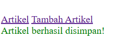

# Praktikum 11 – Modularisasi dengan PHP OOP & Routing

## Nama : Nurul Fadilah

## NIM  : 312410689

Repository ini berisi hasil praktikum 11 mata kuliah Pemrograman Web Universitas Pelita Bangsa.

## TUJUAN ARTIKEL: "Pengenalan PHP dan Perannya dalam Pengembangan Web Modern"

    1. Memberikan pemahaman tentang apa itu PHP.
       - PHP adalah bahasa pemrograman server-side untuk membuat website dinamis.

    2. Menjelaskan alasan mengapa PHP banyak digunakan.
       - Mudah dipelajari, fleksibel, dan cocok untuk pemula maupun profesional.
       - Terintegrasi baik dengan database seperti MySQL.

    3. Menunjukkan peran PHP dalam pengembangan aplikasi web.
       - Mengolah data, menerima input, mengelola sesi, dan berkomunikasi dengan database.

    4. Memberikan gambaran perkembangan PHP di era modern.
       - Tersedia banyak framework seperti Laravel, CI, dan Symfony.
       - Membantu developer membuat aplikasi yang lebih aman dan terstruktur.

    5. Menjelaskan manfaat mempelajari PHP bagi mahasiswa atau developer.
       - Dapat membuat sistem CRUD, login, dashboard, dan aplikasi besar lainnya.
       - PHP tetap relevan dan digunakan luas di dunia industri.

## Struktur Projec

    lab11_php_oop/
    ├── database.php
    ├── form.php
    ├── gambar/
    │   ├── home1.png
    │   ├── home2.png
    │   ├── sukses.png
    │   ├── tambah1.png
    │   └── tambah2.png
    ├── module/
    │   └── artikel/
    │       ├── index.php
    │       ├── tambah.php
    │       └── ubah.php
    ├── home/
    ├── template/
    │   ├── footer.php
    │   ├── header.php
    │   └── sidebar.php
    ├── .htaccess
    ├── config.php
    ├── index.php
    └── README.md

## Fitur

- Routing URL menggunakan `.htaccess`
- Struktur modular (module/home, module/artikel)
- Class OOP (Form & Database)
- CRUD Artikel (Create–Read–Update)
- Template header/footer

  
## Teknologi

- PHP OOP
- MySQL
- Apache mod_rewrite
- HTML

## Screenshot

- Tampilan database setup: 

- Tampilan home1:

- Tampilan home2:

- Tampilan tambah1:

- Tampilan tambah2:

- Tampilan sukses

